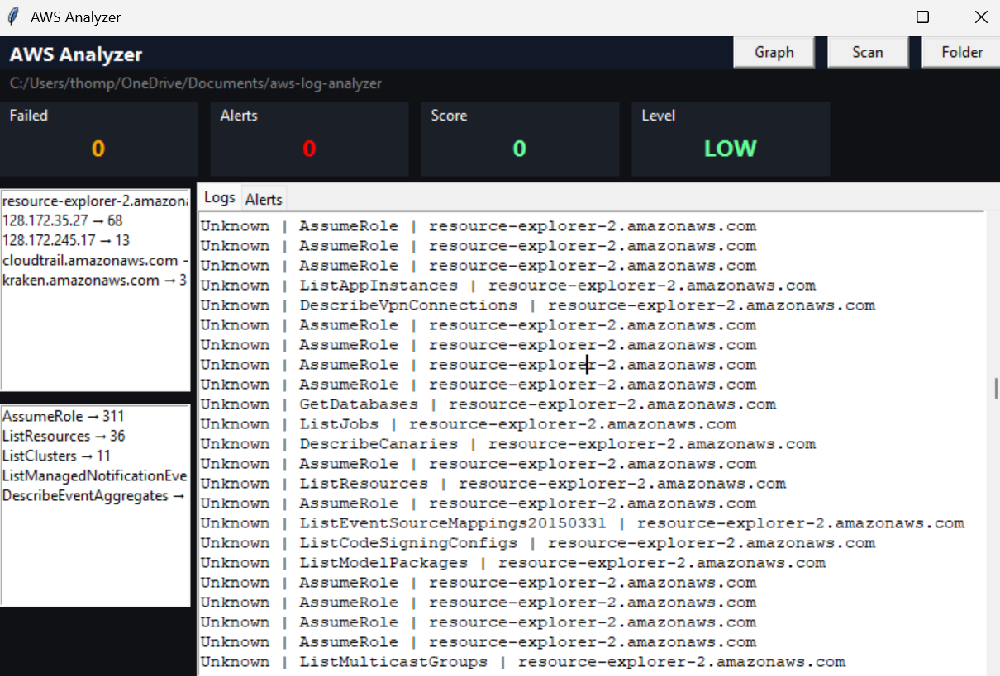
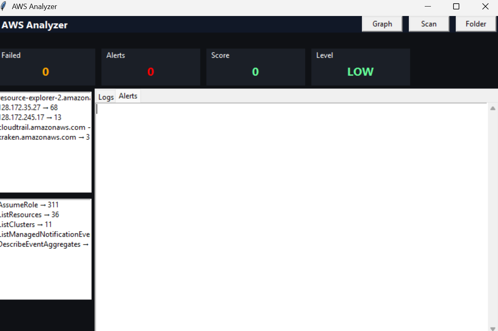
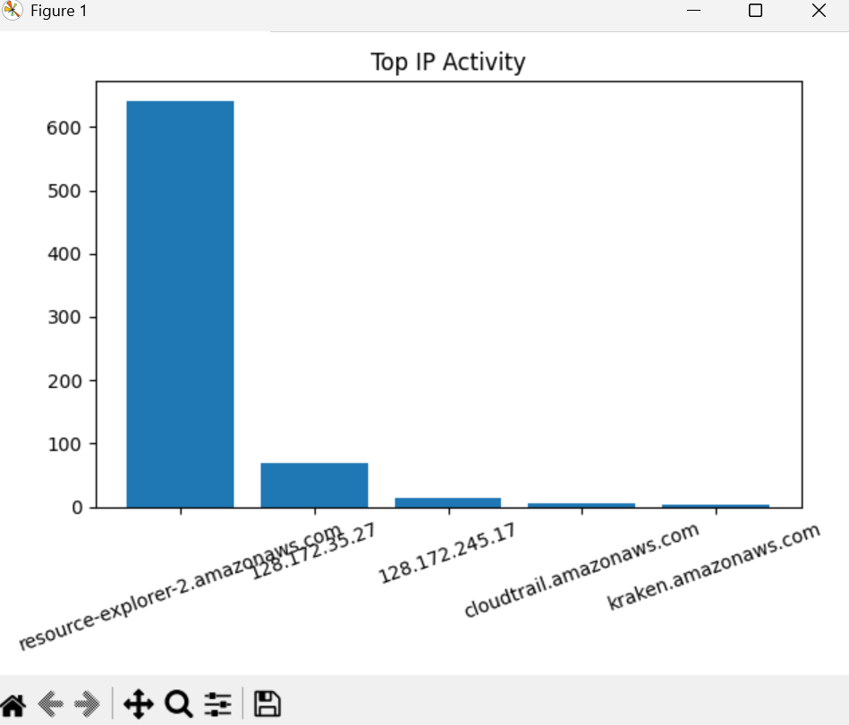
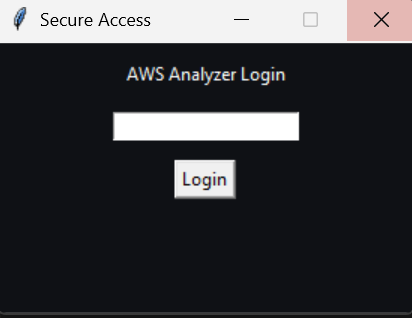
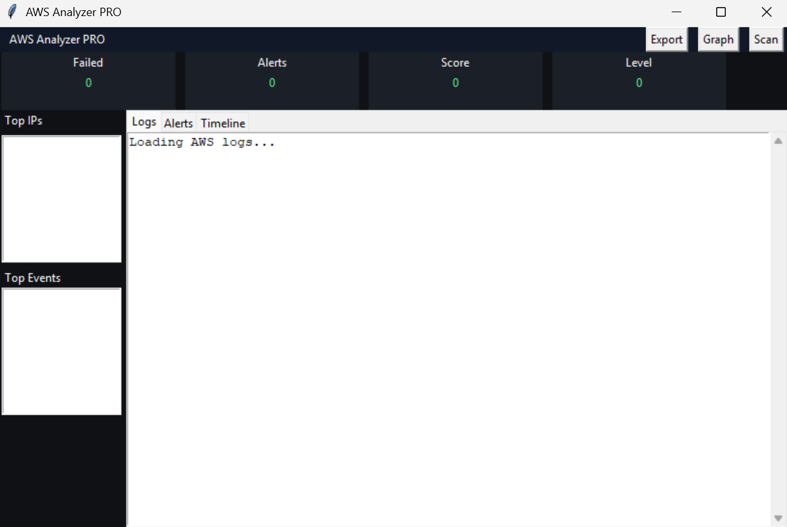

# AWS Analyzer PRO (SIEM-Style Security Tool)

AWS Analyzer PRO is a Python-based SIEM-style security analysis tool designed to detect suspicious activity in AWS CloudTrail logs.

It simulates real-world cybersecurity workflows by combining anomaly detection, threat classification, risk scoring, and timeline reconstruction into a clean GUI dashboard.

---

## 🚀 Key Features

- Threat Scoring System (LOW / MEDIUM / HIGH)
- Anomaly Detection (traffic spikes, IP anomalies)
- Refined Detection Logic (filters AWS internal traffic, reduces noise)
- Threat Classification (Recon, Credential Access, etc.)
- Timeline Attack View (chronological event tracking with timestamps)
- JSON Report Export (structured output for analysis or reporting)
- GUI Dashboard (Tkinter-based SIEM-style interface)
- Login Protection (PIN-based access control)
- Top IP Tracking
- Top Event Tracking
- Alerts + Logs + Timeline Tabs

---

## 🧠 What This Project Demonstrates

- Security Log Analysis (AWS CloudTrail)
- SIEM Concepts & Detection Logic
- Threat Classification & Risk Modeling
- Incident Timeline Reconstruction
- Python GUI Development (Tkinter)
- Data Processing & Pattern Recognition
- Secure Application Design

---

## 🛠 Tech Stack

- Python
- Tkinter (GUI)
- Matplotlib (graph visualization)
- AWS CloudTrail Logs (JSON)

---

## ▶️ How to Run

### Option 1: Run as Application (Recommended)

1. Open the `dist` folder  
2. Double-click **AWS Analyzer PRO.exe**  
3. Enter PIN to access the dashboard  

---

### Option 2: Run via Python
```bash
python gui_analyzer.py

Steps:
Launch the application
Click Folder
Select a directory containing CloudTrail .json logs
Click Scan
Review:
Logs tab
Alerts tab
Timeline tab
Risk Score + Threat Level

⚙️ Build EXE
python -m PyInstaller --onefile --windowed gui_analyzer.py

📤 Export Feature

The tool supports exporting analysis results to JSON format, including:

Detected anomalies
Threat classifications
Timeline events
Risk score summary

🔐 Security Features
PIN-based login protection
External IP filtering
AWS service traffic suppression
Threshold-based anomaly detection
⚠️ Notes
This tool is designed for educational and demonstration purposes
Not intended as a replacement for enterprise SIEM platforms

📈 Future Enhancements
MITRE ATT&CK mapping
Live AWS log ingestion
Web-based dashboard (Flask/React)
Multi-user authentication
Advanced behavioral analytics


## Screenshots
## 📸 Screenshots

### Dashboard


### Alerts


### Export


### Graph


### Timeline


### Login Screen


### Loading Screen
